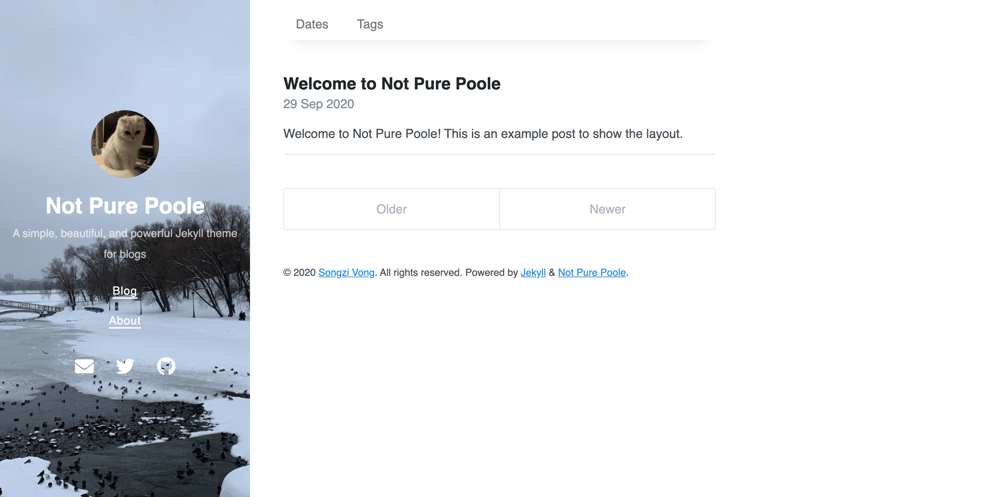

# Not Pure Poole <!-- omit in toc -->

<a href="https://jekyll-themes.com">
  
</a>

**Not Pure Poole** is a simple, beautiful, and powerful Jekyll theme for blogs. It is built on [Poole](https://github.com/poole/poole) and [Pure](https://purecss.io/).

> Poole explains that Jekyll has been asking for a particular chemical for days now but every time it has been fetched for him he rejects it as **not pure**. Poole also explains that he caught a glimpse of the man inside and he looked barely human.
>
> -- <a href="https://www.bbc.co.uk/bitesize/guides/zbtjnrd/revision/6"><cite>The death of Jekyll</cite></a>

-----

See Not Pure Poole in action with [the demo site](https://vszhub.github.io/not-pure-poole/).



## Table of Contents <!-- omit in toc -->

- [Features](#features)
- [Installation](#installation)
- [Usage](#usage)
  - [Configuration](#configuration)
  - [Customizing Head](#customizing-head)
  - [Creating Themes](#creating-themes)
  - [Customizing Navigation](#customizing-navigation)
  - [Customizing Cover Image](#customizing-cover-image)
  - [Customizing Social Links](#customizing-social-links)
  - [Enabling Posts Archive](#enabling-posts-archive)
  - [Enabling TOC](#enabling-toc)
  - [Enabling MathJax](#enabling-mathjax)
  - [Something More](#something-more)
- [Development](#development)
- [License](#license)

## Features

- [Jekyll SEO Tag](https://github.com/jekyll/jekyll-seo-tag)
- [Jekyll Feed](https://github.com/jekyll/jekyll-feed)
- [Jekyll Sitemap](https://github.com/jekyll/jekyll-sitemap)
- [Jekyll Gist](https://github.com/jekyll/jekyll-gist)
- [Google Analytics](https://analytics.google.com/)
- [Disqus](https://disqus.com/)
- [Font Awesome](https://fontawesome.com/)
- [MathJax](https://www.mathjax.org/)
- Dark mode (enabled automatically via CSS media query)
- Posts archive by dates, categories, and tags
- Pagination, generated by [Jekyll Paginate](https://github.com/jekyll/jekyll-paginate)
- TOC (generated by Vladimir "allejo" Jimenez's [jekyll-toc](https://github.com/allejo/jekyll-toc))
- Related posts (time-based, because Jekyll) below each post
- Mobile friendly design and development
- Easily scalable text and component sizing with `rem` units in the CSS
- Support for a wide gamut of HTML elements
- Syntax highlighting, courtesy Pygments (the Python-based code snippet highlighter)

## Installation

You can choose one of the following methods to install Not Pure Poole:

- Directly specify the `not-pure-poole` gem.

    1. Add `gem 'not-pure-poole'` into your `Gemfile`.
    2. Add the below lines into your `_config.yml`.

        ```yml
        plugins:
          - not-pure-poole
        ```

- If your site is hosted on GitHub Pages, you can use [`jekyll-remote-theme`](https://github.com/benbalter/jekyll-remote-theme) to import the master branch of Not Pure Poole.

    1. Add `gem 'jekyll-remote-theme'` into your `Gemfile`.
    2. Add the below lines into your `_config.yml`.

        ```yml
        plugins:
          - jekyll-remote-theme

        remote_theme: vszhub/not-pure-poole
        ```

## Usage

You can read this [example post](https://vszhub.github.io/not-pure-poole/2020/09/29/welcome-to-not-pure-poole/) to see the rendering result in this theme, and put the [source](_posts/2020-09-29-welcome-to-not-pure-poole.md) aside to learn some basic usages.

### Configuration

The [`_config.yml`](_config.yml) file in this repository already contains some variables, you can try to override them in your repository.

### Customizing Head

Not Pure Poole leaves a placeholder to allow defining custom head, in principle, you can add anything here, e.g. favicons. All you need to do is just creating a file `_includes/custom-head.html` and put data into it.

### Creating Themes

If you want to make your own color schemes, modify the CSS variables in the `_sass/_variables.scss` stylesheet with a scoped data attribute or class name.

For example, below we've created the beginnings of a blue theme:

```scss
// Example blue theme
[data-theme="blue"] {
  --body-bg: var(--blue);
  --body-color: #fff;
}
```

Then, apply the theme by adding `data-theme="blue"` to the `<html>` element.

### Customizing Navigation

You can create a file `_data/navigation.yml` to configure links to some pages. For example,

```yml
- title: Blog
  url: /
- title: About
  url: /about/
```

### Customizing Cover Image

You can set your own cover image by modifying the `cover_image` variable in `_config.yml`, and you can also set different cover images on different pages by setting the `cover_image` variable on each page.

If you discover that the contrast between the cover text color and the cover background color is not enough, you can also adjust these two variables:

```yml
cover_bg_color: rgb(40, 73, 77)
cover_color: rgb(255, 255, 255)
```

### Customizing Social Links

You can set your social links in `_data/social.yml`. You can custom titles, URLs, and icons (only support [Font Awesome](https://fontawesome.com/) currently), for example:

```yml
- title: Email
  url: mailto://vszhub@gmail.com
  icon: fas fa-envelope
- title: Twitter
  url: https://twitter.com/vszhub
  icon: fab fa-twitter
- title: GitHub
  url: https://github.com/vszhub/not-pure-poole
  icon: fab fa-github
```

### Enabling Posts Archive

Not Pure Poole supports posts archive by date, categories, and tags. For enabling that, you should put some data like below into `_data/archive.yml`:

```yml
- type: dates
  title: Dates
  url: /dates/
- type: categories
  title: Categories
  url: /categories/
- type: tags
  title: Tags
  url: /tags/
```

After that, the navigation to these archive pages would be shown on the top of the homepage.

Then, you can create a category archive page, and set the below parameters on that page:

```yml
---
layout: archive-taxonomies
type: categories
---
```

Or a tag archive page:

```yml
layout: archive-taxonomies
type: tags
```

Or archive by dates:

```yml
layout: archive-dates
```

### Enabling TOC

If you want to show the TOC of a page on the right side, just set `toc: true` on that page.

### Enabling MathJax

If you want to write mathematics on a page, just set `math: true` on that page to enable MathJax.

### Something More

Just **hack** into the code and see what you can get.

## Development

To set up your environment to develop this theme, run `bundle install`.

Your theme is setup just like a normal Jekyll site! To test your theme, run `bundle exec jekyll serve` and open your browser at `http://localhost:4000`. This starts a Jekyll server using your theme. Add pages, documents, data, etc. like normal to test your theme's contents. As you make modifications to your theme and to your content, your site will regenerate and you should see the changes in the browser after a refresh, just like normal.

When your theme is released, only the files in `_layouts`, `_includes`, `_sass` and `assets` tracked with Git will be bundled.
To add a custom directory to your theme-gem, please edit the regexp in `not-pure-poole.gemspec` accordingly.

## License

The theme is available as open source under the terms of the [MIT License](https://opensource.org/licenses/MIT).
